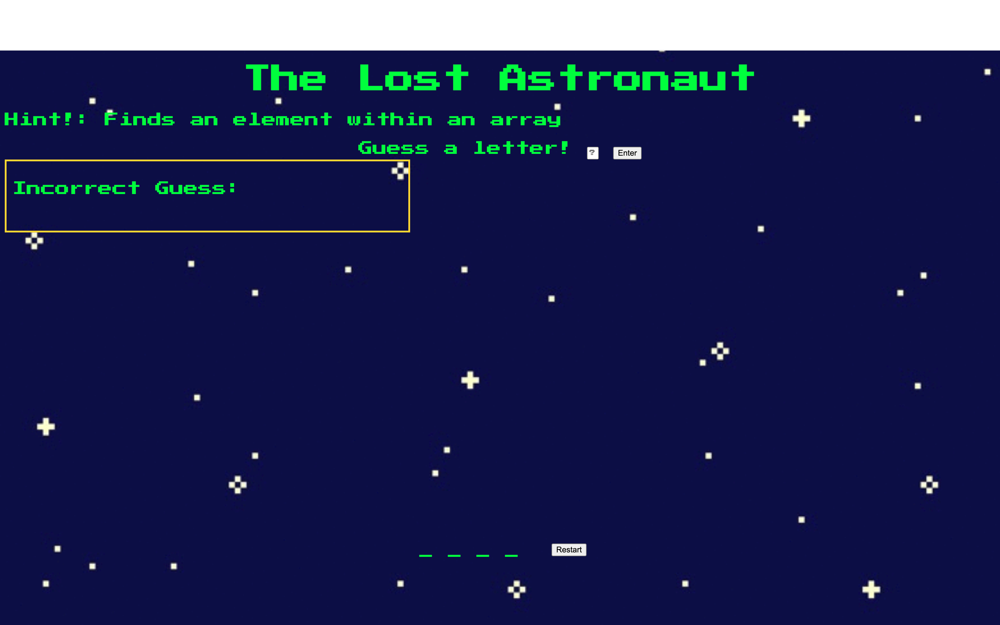
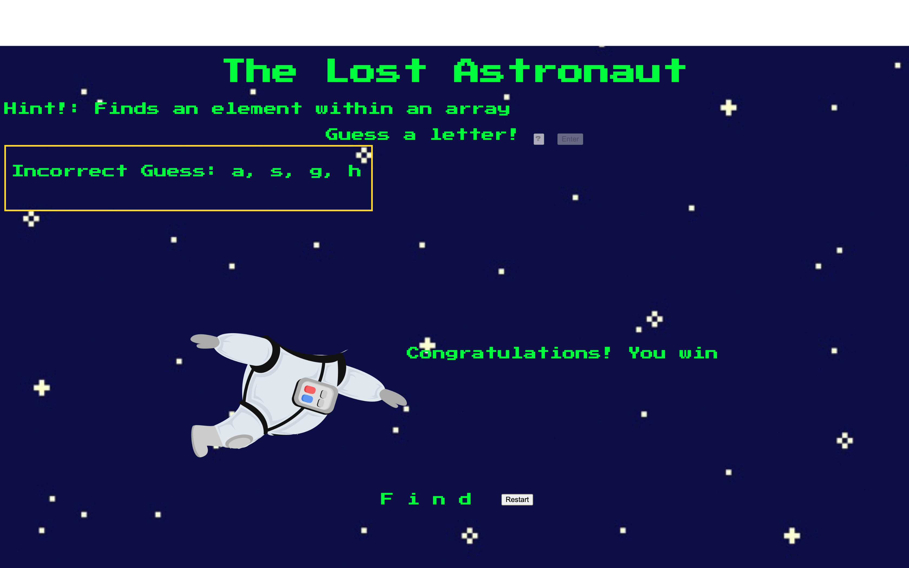

# Lost and Loose
Get ready for a game set somewhere out in space! An astronaut is floating around space and you must guess the word correctly to keep him hidden. Every wrong letter that you guess, a part of his body will start to appear but becareful the max amount of wrong guesses allowed will be six. You must guess the word correctly before that, there will be hints provided to help solve this puzzle. Do you have what it takes to complete this mission? 

## Screenshot

### Starting Screen

### Ending Screen

# Technologies Used

- JavaScript
- HTML
- CSS

# Getting Started
https://lostandlose.netlify.app/