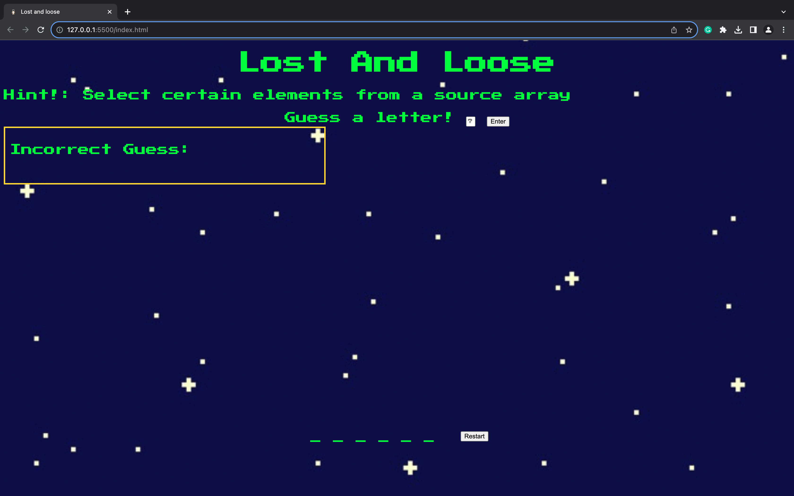

# Lost And Loose
Get ready for a game set somewhere out in space! An astronaut is floating around space and you must guess the word correctly to keep him hidden. Every wrong letter that you guess, a part of his body will start to appear but becareful the max amount of wrong guesses allowed will be six. You must guess the word correctly before that, there will be a hint provided to help solve this puzzle. Do you have what it takes to complete this mission? 

## Screenshots

### Starting Screen

### Ending Screen

## Technologies Used

- JavaScript
- HTML
- CSS

## Getting Started
- You can play this by clicking this link: https://lostandlose.netlify.app/
- You can also play this game by forking it, cloning it your computer and opening the 'index.html' in your browser.

## MVP Goals
- As a player i want my game to recognize when a player has guessed the correct word.
- As a player i would like to be informed when the game is over due to too many incorrect guesses.
- As a player I would like to know how many incorrect guesses I have made.
as a player i would like to see my "guesses" go onto the underscores replace it.
- As a player i would like to be able to restart the game if i win or lose.

## Stretch Goals
- I would like to include some audio for when a players guesses correctly or incorrectly.
- I would like to add some visual effects on the astronaut.
- I would like to add easy, medium and hard levels.

## Favorite Function
- document.getElementById("letter-guess").addEventListener("keydown", function (e) {
   if (e.keyCode === 13) {
       checkGuess(e)

## Reference
Used google for the astronaut image as well as google fonts.

